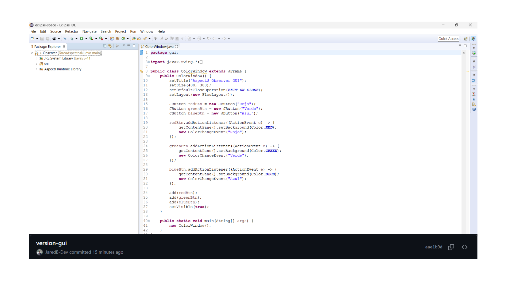
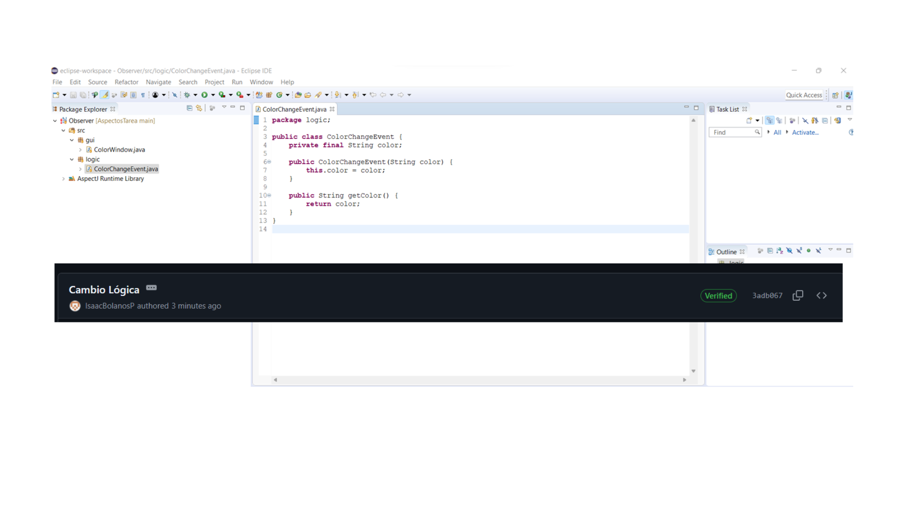

# AspectosTarea

## Imagen Lider

## Imagen Integrante 1

## Imagen Integrante 2

## Imagen Integrante 3

## Funcionalidad Adicional

Se implementó un aspecto adicional llamado `ClickCounterAspect.aj` que actúa como un **contador de clics**. Cada vez que se presiona un botón en la ventana, se crea una instancia de `ColorChangeEvent`.

El aspecto intercepta esa creación y aumenta un contador, mostrando en consola cuántas veces se ha hecho clic.

Esto ejemplifica el AOP para separar lógica de monitoreo.

## Ejemplo de salida:

